<picture>
  <source media="(prefers-color-scheme: dark)" srcset="assets/header-genai-dark.svg">
  <source media="(prefers-color-scheme: light)" srcset="assets/header-genai-light.svg">
  
</picture>

## Generative AI engineer building RAG systems you can trust

<table>
<tr><td><b>Focus</b></td><td>RAG platforms, LLM evaluation, LLM security</td></tr>
<tr><td><b>Latest</b></td><td>Sovereign enterprise RAG platform, OCP Solutions (2026)</td></tr>
<tr><td><b>Degree</b></td><td>State engineer in Computer Science, ENSA Kénitra (2026)</td></tr>
<tr><td><b>Based in</b></td><td>Morocco</td></tr>
<tr><td><b>Open to</b></td><td>GenAI engineer, AI engineer and AI security roles</td></tr>
<tr><td><b>Contact</b></td><td><a href="https://linkedin.com/in/rayane-el-ouarrat-460abb22a">LinkedIn</a> &nbsp;/&nbsp; <a href="https://ryanelouarrat.github.io/portfolio/">Portfolio</a> &nbsp;/&nbsp; <a href="mailto:ryanelouarrat.pro@gmail.com">Email</a></td></tr>
</table>

## Featured work

<table>
<tr>
<td width="50%" valign="top">

### 🏗️ Sovereign RAG platform
**OCP Solutions, 2026**

An enterprise knowledge platform where no document leaves the company and any model can be swapped out.

`Docling` `Milvus` `BM25` `Qwen3.5-9B` `Qwen3-Embed` `MinIO`

</td>
<td width="50%" valign="top">

### ⚖️ LLM response evaluator
**OCP Solutions, 2026**

Scores RAG answers with a panel of LLM judges and majority voting, so configurations are compared on evidence.

`asyncio` `Pydantic` `httpx` `LLM-as-a-judge` `JSONL`

</td>
</tr>
<tr>
<td width="50%" valign="top">

### 🛡️ LLM for SOC triage
**Ministry of Economy and Finance, 2025**

An LLM adapted to 180 incident scenarios that drafts triage and response plans following NIST SP 800-61.

`n8n` `React` `Firebase` `LLM`

</td>
<td width="50%" valign="top">

### 🌱 Crop and weed vision models
**ENSA Kénitra**

U-Net segmentation and YOLOv11 detection trained on PhenoBench, tuned with Optuna and exported for deployment.

`PyTorch` `U-Net` `YOLOv11` `Optuna` `ONNX`

</td>
</tr>
</table>

<details>
<summary><b>How the RAG platform works</b> (click to expand)</summary>
<br>


- **Swappable components.** Each stage sits behind a shared Python SDK contract, so a parser, embedder or LLM can be replaced without touching the rest.
- **Hybrid retrieval.** BM25 and dense vectors are combined, then small-to-big expansion returns the context around each match.
- **Grounded answers.** Every answer cites its sources and traces back to the retrieved documents.
- **Security.** Retrieval respects access control, services are isolated, actions are auditable, and the pipeline was tested against prompt injection.
- **Beyond classic RAG.** I explored agentic and graph RAG variants on the same platform.

The code is confidential. I'm happy to walk through the design on a call.

</details>

<details>
<summary><b>How the evaluator works</b> (click to expand)</summary>
<br>

An LLM judge compares each answer with the reference and the retrieved context and returns a strict yes or no verdict. An odd number of judges vote, concurrency is capped with semaphores, and every verdict is written to JSONL so runs are reproducible and comparable.

</details>

## Side projects

| Project | What it does |
|---|---|
| [resume-tailor](https://github.com/ryanelouarrat/resume-tailor) | n8n workflow that matches a job post to my experience with pgvector and compiles a tailored LaTeX CV |
| [Cerberus](https://github.com/ryanelouarrat/cerberus) | Python web vulnerability scanner for SQLi, XSS, path traversal and hidden directories |
| [NutriTrack](https://github.com/ryanelouarrat/nutritrack-stack) | React, Spring Boot, Flask and MySQL app run with Docker Compose |

Also: visual servoing research comparing NeRF, Gaussian Splatting and mesh scenes on A100 GPUs, and national CTF podiums in 2026.

## Toolbox

```yaml
llms:        [qwen3.5, openai-compatible apis, prompt engineering, llm-as-a-judge]
retrieval:   [hybrid bm25 + dense, milvus, pgvector, docling, chunking strategies]
training:    [pytorch, u-net, yolov11, optuna, onnx]
engineering: [python, asyncio, pydantic, httpx, gradio, n8n, docker, minio]
security:    [prompt-injection testing, access control, burp-suite, nmap]
```
